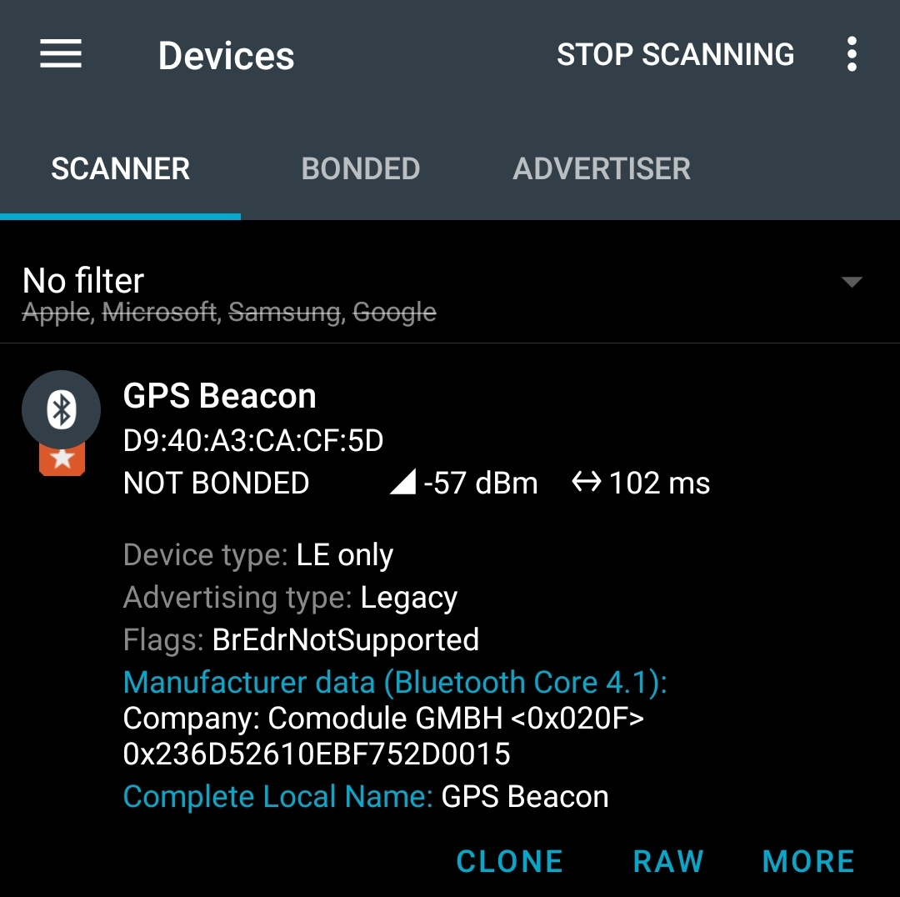

<div align="center">
<h2>GPS Beacon</h2>
</div>

# About
This project turns the [nRF52840 DK board](https://www.nordicsemi.com/Products/Development-hardware/nrf52840-dk) into a Bluetooth Low Energy (BLE) beacon that
broadcasts GPS coordinates supplied to it over a UART connection. The project was
completed as an embedded C and Bluetooth coding exercise.

# Usage
In order to use the GPS beacon, the nRF52840 development kit must be powered on and
flashed with the firmware from this project (see [Building](#building) for instructions
on how to build the image and flash the board).

## Serial interface
The UART interface on the board was chosen as the means for supplying GPS coordinates to
the device. This is a convenient interface for both other MCUs and PCs, as a connection
can be made via the exposed UART pins or via the onboard USB-to-UART converter.

The UART interface is configured to use the following settings:
- **Baud rate**: 115200
- **Data bits**: 8
- **Parity**: None
- **Stop bits**: 1
- **Flow control**: None

Once powered on, the GPS beacon will set up the UART and Bluetooth interfaces and
transmit the following message over UART:
```
Boot complete
```

It will not start broadcasting the advertising data immediately, as the GPS coordinates
need to be specified beforehand. In order to set and update the coordinates being
broadcast, send the `pos-set <latitude> <longitude> <altitude>` followed by a newline
character (`\n`) over the UART interface.

The parameters are as follows:
- `latitude` is the latitude in decimal degrees, represented as a floating-point number
  in the range [-90, 90]. Positive values are on the northern hemisphere, negative
  values on the southern hemisphere. For example, `38° 53′ 23″ N` is expressed as
  `38.8897`.
- `longitude` is the longitude in decimal degrees, represented as a floating-point
  number in the range [-180, 180]. Positive values are on the eastern hemisphere,
  negative values on the western hemisphere.
- `altitude` is the altitude in meters, represented as an integer in the range [-32768,
  32767]. Positive values are above sea level, negative values below sea level.

Example command with response:
```
> pos-set 59.4367073 24.7428397 21
OK: Set position to 594367073, 247428397, 21
```

Once the coordinates have been set, you can send `ad-start` to start the flow of
Bluetooth advertising data:
```
> ad-start
OK: Advertising started
```

Note that advertising cannot be started until the coordinates have been set. If you
attempt to start advertising before setting the coordinates, the following error
message will be returned:
```
> ad-start
ERROR: Failed to start advertising (code -1)
```

You may update the coordinates being transmitted at any time using `pos-set`. If you
wish to deactivate the beacon, use the command `ad-stop`. You can also use `help` to
list the commands supported by the device:
```
> help
Available commands:
  ad-start - Start advertising
  ad-stop - Stop advertising
  help - Print this help message
  pos-set lat lon alt - Set latitude, longitude and altitude
```

## Bluetooth behaviour
Once the coordinates have been set and advertising has been started, the device will
start broadcasting custom advertising data packets. [nRF Connect](https://www.nordicsemi.com/Products/Development-tools/nrf-connect-for-mobile) is a useful mobile app that can be
used to monitor the advertising data packets and verify the correct operation of the
beacon.

Given example coordinates from the [Serial interface](#serial-interface) section above,
the beacon will appear as follows in nRF Connect:



The device is a BLE Broadcaster that does not accept connections. It transmits the
supplied GPS coordinates in the manufacturer-specific data section of the advertising
data packet. In this example, the data payload is:

| `23 6D 52 61` | `0E BF 75 2D` | `00 15` |
| :---: | :---: | :---: |
| Latitude | Longitude | Altitude|

Decoding the data:
- **Latitude**: transmitted as a 32-bit signed integer in units of 1/10,000,000 degrees.
  This yields a worst-case resolution of 11.1 mm at the equator ([calculation](https://en.wikipedia.org/wiki/Decimal_degrees#Precision)).  
  `0x236D5261` → `594367073` → `59.4367073 N`
- **Longitude**: transmitted as a 32-bit signed integer in units of 1/10,000,000 degrees
  like the latitude.  
  `0x0EBF752D` → `247428397` → `24.7428397 E`
- **Altitude**: transmitted as a 16-bit signed integer in units of 1 meter.  
  `0x0015` → `21` → `21 m`

# Development
This section contains information relevant to developers that wish to modify the
project.

## Prerequisites
The project has been developed using the [nRF Connect SDK](https://www.nordicsemi.com/Products/Development-software/nRF-Connect-SDK)
which is the SDK that Nordic Semiconductor [recommend](https://devzone.nordicsemi.com/nordic/nordic-blog/b/blog/posts/nrf-connect-sdk-and-nrf5-sdk-statement)
for new projects using their hardware going forward.

In order to set up a development environment, the below software is required. The
[Get started](https://www.nordicsemi.com/Products/Development-software/nRF-Connect-SDK/GetStarted)
page by Nordic Semiconductor has the relevant download links.
- **nRF Connect for Desktop**
- **nRF Command Line Tools**
- **Toolchain Manager** (installed via nRF Connect for Desktop)
- **nRF Connect SDK v2.2.0** (installed via Toolchain Manager)
- Optional: **Visual Studio Code + nRF Connect extensions** (for ease of development;
installed via Toolchain Manager)

## Building
It is easiest to develop and build the project using VS Code. See: [Instructions](https://nrfconnect.github.io/vscode-nrf-connect/get_started/build_app_ncs.html).

If you choose to use a different IDE, you may follow the
[Building on the command line](https://developer.nordicsemi.com/nRF_Connect_SDK/doc/latest/nrf/gs_programming.html#id3)
instructions in the nRF Connect SDK documentation to use the `west` tool for building
and flashing the board.

Build command:
```
west build --build-dir build --board nrf52840dk_nrf52840
```

Flash to the board connected via USB:
```
west flash --erase
```
